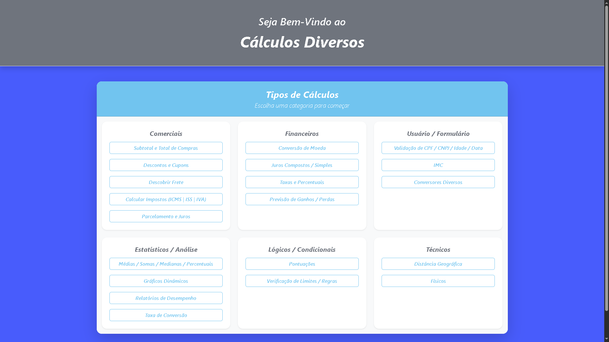
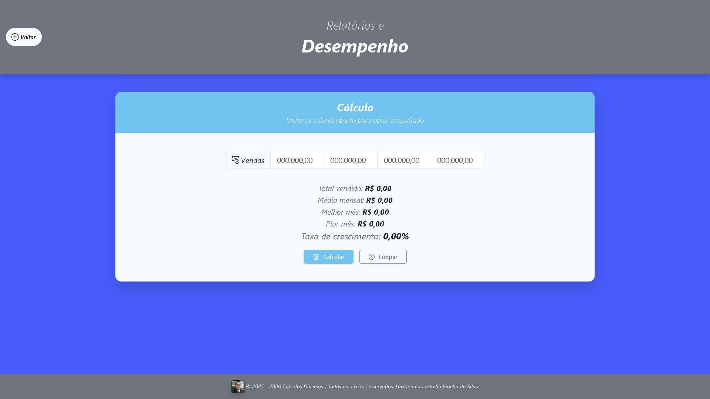

# 🔢 Cálculos Diversos

## 📜 Sobre

Aplicação web para cálculos com **Laravel**, com foco em:

- Todos os tipos de cálculos usados.

---

## ✨ Funcionalidades

- Subtotal e total de compras.
- Descontos e cupons.
- Descobrir frete.
- Calcular impostos.
- Parcelamento e juros.
- Conversão de moeda.
- Juros compostos/simples.
- Taxas e percentuais.
- Previsão de ganhos/perdas.
- Validação de CPF/CNPJ/Idade/Data.
- IMC.
- Conversores diversos.
- Médias/Somas/Medianas/Percentuais.
- Gráficos dinâmicos.
- Relatórios de desempenho.
- Taxa de conversão.
- Pontuações.
- Verificação de limites/regras.
- Distância geográfica.
- Físicos.

---

## 🧱 Stack

- **Backend:** PHP 8.5.3 + Laravel 12
- **Frontend build:** Vite + CSS/JS
- **Banco de dados:** MySQL 8
- **Testes:** Não
- **Containerização:** Docker

---

## 📁 Estrutura Principal

```text
app/
  Http/    
    Controllers/          # Fluxos principais
  Services/               # Regras de negócio auxiliares
docs/                     # Imagens usadas pelo site (Documentação do projeto)
public/
  assets/
    images/               # Imagem usada pelo site (Proprietário)
    js/                   # Interatividade do frontend
resources/
  css/                    # Estilos personalizados  
  views/                  # Telas Blade
routes/
  web.php                 # Rotas da aplicação
```

## 📸 Demonstração




---

## ✅ Pré-Requisitos

- PHP 8.5+
- Composer 2+
- Node.js 20+

---

## 🚀 Como Rodar Localmente

1. Clone o projeto:

```bash
git clone <url-do-repositorio>
cd calculos-diversos
```

2. Instale dependências PHP:

```bash
composer install
```

3. Instale dependências front-end:

```bash
npm install
```

4. Crie o arquivo de ambiente:

```bash
cp .env.example .env
```

5. Gere a chave da aplicação:

```bash
php artisan key:generate
```

6. Configure as variáveis de banco no `.env`.

7. Suba o ambiente de desenvolvimento (server + queue + vite):
 
```bash
composer run dev
```

> O comando acima executa `php artisan serve`, `queue:listen` e `npm run dev` em paralelo.

---

## ⚙️ Variáveis de Ambiente Importantes

Ajuste pelo menos:

- `APP_NAME`, `APP_ENV`, `APP_KEY`, `APP_DEBUG`, `APP_URL`
- `CACHE_STORE`
- `LOG_CHANNEL`, `LOG_LEVEL`
- `QUEUE_CONNECTION`
- `SESSION_DRIVER`, `SESSION_HTTP_ONLY`, `SESSION_SECURE_COOKIE`

---

## 🐳 Docker

Este projeto possui `Dockerfile` para facilitar execução/deploy.

Exemplo de build e run:

```bash
docker build -t calculos-diversos .
docker run -p 8080:8080 --env-file .env calculos-diversos
```

Comando de start definido no container:

```bash
php artisan migrate --force && php artisan optimize && php artisan config:cache && php artisan route:cache && php artisan view:cache && php artisan serve --host=0.0.0.0 --port=${PORT:-8080}
```

---

## ☁️ Deploy (Ex.: Railway)

Checklist recomendado:

1. Criar projeto usando o repositório do GitHub.
3. Configurar variáveis de ambiente de produção.
 
---

## 🗺️ Roadmap Técnico Sugerido (Melhorias)

- Nenhum.

---

## 👨‍💻 Autor

Projeto desenvolvido por: **Luciano Eduardo Stefanello da Silva**.
